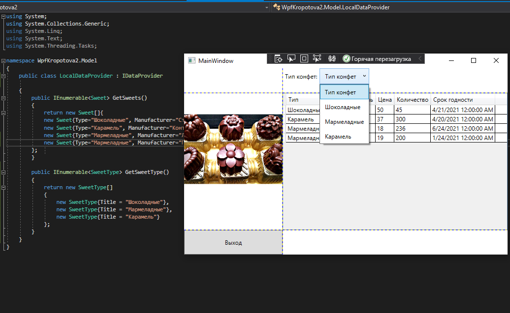

<table style="width: 100%;">
  <tr>
    <td style="text-align: center; border: none;">
    Министерство образования и науки РФ<br>
Государственное бюджетное профессиональное образовательное учреждение Республики Марий Эл<br>
Йошкар-Олинский технологический колледж
</td>
  </tr>
  <tr>
    <td style="text-align: center; border: none; height: 15em;">
    <h2 style="font-size:3em;">Отчет</h2>
      <h3>по лабораторной работе<br><br> по дисциплине "Основы алгоритмизации и программирования"<br><br> Тема:<b>"Каркас приложения. Модель данных. Привязка данных. Табличный вывод."<b> </h3></td>
  </tr>
  <tr>
    <br><br><td style="text-align: right; border: none; height: 20em;">
      Разработал:<br/>
      Кропотова Юлия<br>
      Группа: И-21<br>
      Преподаватель:<br>
      Колесников Евгений Иванович
    </td>
  </tr>
  <tr>
    <td style="text-align: center; border: none; height: 5em;">
    г.Йошкар-Ола, 2021</td>
  </tr>
</table>

<div style="page-break-after: always;"></div>

# Цели и задачи:
 1. Создать Модель данных
 2. Создать Каркас приложения.
 3. Привязка данных. Табличный вывод


# Краткий материал.


Сначала создадим класс для элемента справочника

```
public class CatBreed { 
    public string Title { get; set; }
}
```

Пока в этом особого смысла нет, но при работе с БД у нас будут таки классы, поэтому сразу привыкаем к правильному коду.

Создаем в классе главного окна свойство для хранения справочника

```
public List<CatBreed> CatBreedList { get; set; }
```

Здесь мы выбрали тип List, т.к. нам нужен изменяемый список, в который мы добавим элемент "Все породы"

В интерфейс поставщика данных (IDataProvider) добавляем метод для получения списка категорий

```
IEnumerable<CatBreed> GetCatBreeds();
```

2. Чтобы задать позицию элемента управления с привязкой к определенной ячейке Grid-а, в разметке элемента нужно прописать значения свойств Grid.Column и Grid.Row, тем самым указывая, в каком столбце и строке будет находиться элемент. Кроме того, если мы хотим растянуть элемент управления на несколько строк или столбцов, то можно указать свойства Grid.ColumnSpan и Grid.RowSpan, как в следующем примере:

    ```


```xml
 <Grid ShowGridLines="True">
        <Grid.RowDefinitions>
            <RowDefinition Height="auto"/>
            <RowDefinition />
            <RowDefinition Height="50"/>
        </Grid.RowDefinitions>
        <Grid.ColumnDefinitions>
            <ColumnDefinition Width="200"/>
            <ColumnDefinition/>
        </Grid.ColumnDefinitions>
        <Image 
            Source="./Sweet/конфеты.jpg" 
            Grid.RowSpan="2"/>

        <StackPanel 
        Orientation="Vertical"
        Grid.RowSpan="3"
        VerticalAlignment="Bottom">
            <Button 
            x:Name="ExitButton"
            Content="Выход" 
            Click="ExitButton_Click"
            Height="50"/>
        </StackPanel>
        <WrapPanel
        Orientation="Horizontal"
        Grid.Column="1"
        MinHeight="50">
        </WrapPanel>
        <DataGrid
    Grid.Row="1"
            Grid.Column="1"
    CanUserAddRows="False"
    AutoGenerateColumns="False"
    ItemsSource="{Binding SweetList}" Grid.ColumnSpan="2">
```


```xml
        <DataGrid.Columns>
                <DataGridTextColumn
            Header="Тип"
            Binding="{Binding Type}"/>
                <DataGridTextColumn
            Header="Производитель"
            Binding="{Binding Manufacturer}"/>
                <DataGridTextColumn
            Header="Цена"
            Binding="{Binding Price}"/>
                <DataGridTextColumn
            Header="Количество"
            Binding="{Binding Count}"/>
                <DataGridTextColumn
            Header="Срок годности"
            Binding="{Binding ShelfLife}"/>
            </DataGrid.Columns>
        </DataGrid>
```

# Вывод

Мы научились работать и создавать WPF-приложения и компоновкой, создавать приложение WPF .NET Framework, исследовали контейнеры
А так же Grid, StackPanel, WrapPanel"# wpfKolesnikov" 
