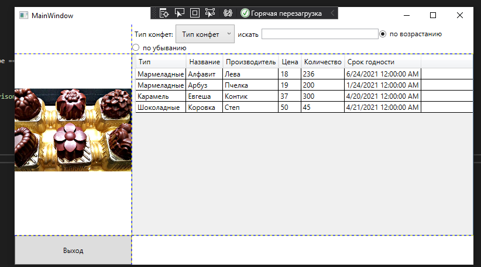

<table style="width: 100%;">
  <tr>
    <td style="text-align: center; border: none;">
    Министерство образования и науки РФ<br>
Государственное бюджетное профессиональное образовательное учреждение Республики Марий Эл<br>
Йошкар-Олинский технологический колледж
</td>
  </tr>
  <tr>
    <td style="text-align: center; border: none; height: 15em;">
    <h2 style="font-size:3em;">Отчет</h2>
      <h3>по лабораторной работе<br><br> по дисциплине "Основы алгоритмизации и программирования"<br><br> Тема:<b>"Поиск, сортировка."<b> </h3></td>
  </tr>
  <tr>
    <br><br><td style="text-align: right; border: none; height: 20em;">
      Разработал:<br/>
     Кропотова Юлия<br>
      Группа: И-21<br>
      Преподаватель:<br>
      Колесников Евгений Иванович
    </td>
  </tr>
  <tr>
    <td style="text-align: center; border: none; height: 5em;">
    г.Йошкар-Ола, 2021</td>
  </tr>
</table>

<div style="page-break-after: always;"></div>

# Цели и задачи:
 1. TextBox (ввод строки для поиска) 
 2. RadioButton (сортировка по одному полю)
 3. Привязка данных. Табличный вывод


# Краткий материал.


Сначала создадим класс для элемента справочника

```
public class CatBreed { 
    public string Title { get; set; }
}
```

Пока в этом особого смысла нет, но при работе с БД у нас будут таки классы, поэтому сразу привыкаем к правильному коду.

Создаем в классе главного окна свойство для хранения справочника

```
public List<CatBreed> CatBreedList { get; set; }
```

Здесь мы выбрали тип List, т.к. нам нужен изменяемый список, в который мы добавим элемент "Все породы"

В интерфейс поставщика данных (IDataProvider) добавляем метод для получения списка категорий

```
IEnumerable<CatBreed> GetCatBreeds();
```

2. В разметке добавляем радиокнопки
    ```


```xml
 <Window x:Class="WpfKropotova2.MainWindow"
        xmlns="http://schemas.microsoft.com/winfx/2006/xaml/presentation"
        xmlns:x="http://schemas.microsoft.com/winfx/2006/xaml"
        xmlns:d="http://schemas.microsoft.com/expression/blend/2008"
        xmlns:mc="http://schemas.openxmlformats.org/markup-compatibility/2006"
        xmlns:local="clr-namespace:WpfKropotova2"
        mc:Ignorable="d"
        Title="MainWindow" Height="450" Width="800">
    <Grid ShowGridLines="True">
        <Grid.RowDefinitions>
            <RowDefinition Height="auto"/>
            <RowDefinition />
            <RowDefinition Height="50"/>
        </Grid.RowDefinitions>
        <Grid.ColumnDefinitions>
            <ColumnDefinition Width="200"/>
            <ColumnDefinition/>
        </Grid.ColumnDefinitions>
        <Image 
            Source="./Sweet/конфеты.jpg" 
            Grid.RowSpan="2"/>

        <StackPanel 
        Orientation="Vertical"
        Grid.RowSpan="3"
        VerticalAlignment="Bottom">
            <Button 
            x:Name="ExitButton"
            Content="Выход" 
            Click="ExitButton_Click"
            Height="50"/>
        </StackPanel>
        <WrapPanel
        Orientation="Horizontal"
        Grid.Column="1"
        MinHeight="50">
            <Label 
    Content="Тип конфет:"
    VerticalAlignment="Center"
                />
            <ComboBox
    Name="TypeFilterComboBox"
    SelectionChanged="TypeFilterComboBox_SelectionChanged"
    VerticalAlignment="Center"
    MinWidth="100"
    SelectedIndex="0"
    ItemsSource="{Binding SweetTypeList}">
                <ComboBox.ItemTemplate>
                    <DataTemplate>
                        <Label 
                Content="{Binding Title}"/>
                    </DataTemplate>
                </ComboBox.ItemTemplate>
            </ComboBox>
            <Label 
    Content="искать" 
    VerticalAlignment="Center"/>
            <TextBox
    Width="200"
    VerticalAlignment="Center"
    x:Name="SearchFilterTextBox" 
    KeyUp="SearchFilterTextBox_KeyUp"/>

            <RadioButton
    GroupName="Name"
    Tag="1"
    Content="по возрастанию"
    IsChecked="True"
    Checked="RadioButton_Checked"
    VerticalAlignment="Center"/>
            <RadioButton
    GroupName="Name"
    Tag="2"
    Content="по убыванию"
    Checked="RadioButton_Checked"
    VerticalAlignment="Center"/>
        </WrapPanel>
        <DataGrid
    Grid.Row="1"
            Grid.Column="1"
    CanUserAddRows="False"
    AutoGenerateColumns="False"
    ItemsSource="{Binding SweetList}" Grid.ColumnSpan="2">
            <DataGrid.Columns>
                <DataGridTextColumn
            Header="Тип"
            Binding="{Binding Type}"/>
                <DataGridTextColumn
            Header="Название"
            Binding="{Binding Name}"/>
                <DataGridTextColumn
            Header="Производитель"
            Binding="{Binding Manufacturer}"/>
                <DataGridTextColumn
            Header="Цена"
            Binding="{Binding Price}"/>
                <DataGridTextColumn
            Header="Количество"
            Binding="{Binding Count}"/>
                <DataGridTextColumn
            Header="Срок годности"
            Binding="{Binding ShelfLife}"/>
            </DataGrid.Columns>
        </DataGrid>
    </Grid>
</Window>

```


```xml
        <DataGrid.Columns>
                <DataGridTextColumn
            Header="Тип"
            Binding="{Binding Type}"/>
                <DataGridTextColumn
            Header="Производитель"
            Binding="{Binding Manufacturer}"/>
                <DataGridTextColumn
            Header="Цена"
            Binding="{Binding Price}"/>
                <DataGridTextColumn
            Header="Количество"
            Binding="{Binding Count}"/>
                <DataGridTextColumn
            Header="Срок годности"
            Binding="{Binding ShelfLife}"/>
            </DataGrid.Columns>
        </DataGrid>
```

# Вывод

Мы научились работать и создавать WPF-приложения и компоновкой, создавать приложение WPF .NET Framework, исследовали контейнеры
А так же Grid, StackPanel, WrapPanel"
Добавили кнопки и сортировку по названию и доработали геттер списка конфет
